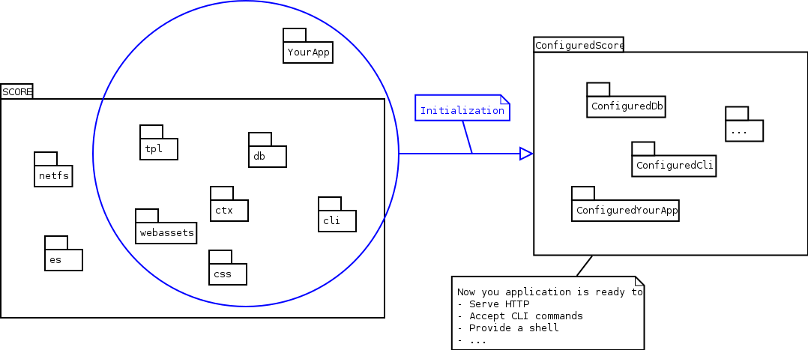

.. _tutorial_initialization:
.. _module_initialization:

**************
Initialization
**************

An application built on SCORE starts by initializing its modules, setting up a
configured environment in which your operations are executed:

    The SCORE Initialization process in a nutshell

The application itself must adhere to the same initialization rules as all
SCORE libraries: It must expose a function called *init* with the following
characteristics:

- The *init* function must accept a python `dict` as its first argument,
  containing your module's configuration—the so-called :term:`confdict`. This
  confdict contains strings as values, and the body of the *init*  function
  must make use of the various parsing functions in :mod:`score.init`  to
  convert the strings to the proper types:

  .. code-block:: python

    from score.init import parse_list

    def init(confdict):
        fruits = parse_list(confdict['fruits'])
        ...

- The other parameters to this function are your module's dependencies, i.e.
  names of other modules that your module relies on. A module for
  transporting coconuts (depending on the *swallow* module, optionally making
  use of an existing *knights* module) might look like the following:

  .. code-block:: python

    from score.init import parse_time_interval

    def init(confdict, swallow, knights=None):
        coconut_weight = int(confdict.get('weight', 10))
        if swallow.max_payload_weight < coconut_weight
            raise InitializationError(
                'coconut', 'Swallow cannot transport coconut')
        timeout = parse_time_interval(confdict.get('assume_dead', '1d'))
        return ConfiguredCoconutModule(coconut_weight, timeout)

- Finally, your ``init`` function must return an instance of
  :class:`score.init.ConfiguredModule` containing a configured instance of
  your module. This object will be used to represent your module throughout
  the rest of the application:

  .. code-block:: python

    from score.init import ConfiguredModule

    class ConfiguredCoconutModule(ConfiguredModule):

        def __init__(self, weight, timeout):
            import coconut
            super().__init__(coconut)
            self.weight = weight
            self.timeout = timeout

        def estimate_delivery_time(self, swallow, from, to):
            # TODO: do some real calculations here
            return 42

That's all there is to know! Now let's create an example application using this
information: A :ref:`blog for the ministry of silly walks <tutorial_project>`.
